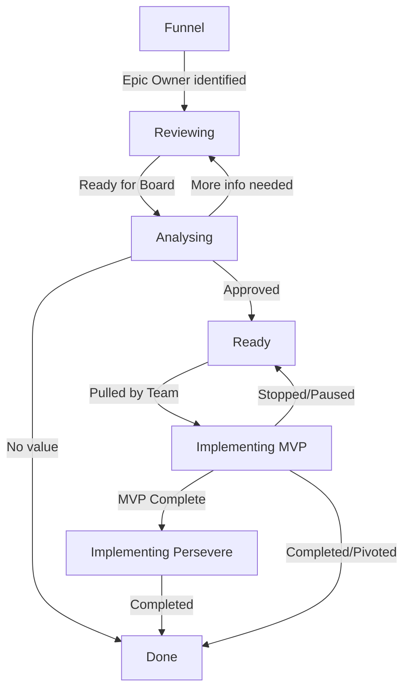

# Epic Kanban Board States

This document defines the workflow, states, and transition criteria for the Epic Kanban System.

## State Overview Table

| Funnel | Reviewing | Analysing | Ready | Implementing MVP | Implementing Persevere | Done |
| :--- | :--- | :--- | :--- | :--- | :--- | :--- |
|      |      |      |      |      |      |      |

## Workflow Diagram

## State Definitions

### 1. Funnel
**Purpose:** Entry point for all big needs and ideas.

All new Epics start in Funnel. This state is used to capture potential needs before any commitment or prioritisation is made.

> **Note:** If it is unclear whether a need or idea should become an Epic, start by creating an **Explore item** in Jira. This provides a blank space to investigate and discuss the idea.
>
> For example, if a new instrument is planned but there has been no discussion of its software needs, use an Explore item to investigate. Start the Explore in Funnel and move it to Done once exploration is complete. Epics may emerge as part of this process.

### 2. Reviewing
**Purpose:** Initial refinement with ownership.

An Epic moves from Funnel to Reviewing once an Epic Owner with capacity has been identified. In this state, the Epic Owner refines the Epic, clarifies scope and intent, and prepares it for wider review.

### 3. Analysing
**Purpose:** Ready for wider consumption and Board prioritisation.

An Epic moves into Analysing when it is sufficiently well-formed for consideration by the Board. Before moving an Epic into this state, the Product Manager checks with the Epic Owner and seeks agreement from the Team Lead.

**Board Decisions:**

* **Move back to Reviewing:** If the Epic lacks clarity or key information.
* **Move to Ready:** If the Epic is deemed valuable and well-understood.
* **Move to Done:** If the Epic is judged to have insufficient value.
* **Conditional Review:** The Board may request specific follow-up work. If this work is completed and no objections are raised within one week (via email), the Epic may move to Ready.

### 4. Ready
**Purpose:** Prioritised backlog of approved Epics.

The Ready state contains Epics that have been approved by the Board.

Once all Epics in Analysing have been cleared, the Epics that reach Ready are candidates for prioritisation. In practice, prioritisation is deferred until after Epics in Implementing have been discussed. Relative prioritisation is then performed across Epics in both Ready and Implementing.

An Epic in Ready may be moved to Done if it becomes irrelevant, for example if an instrument upgrade is cancelled and the associated software work is no longer required.

> **Note:** At present, there is no separate prioritisation for business Epics versus enabler Epics.

### 5. Implementing MVP
**Purpose:** Delivery of the minimum viable product.

An Epic moves into Implementing MVP once it is pulled by a Team.

**Team and Epic Owner Guidance:**
* Small deviations from the original Epic goals are acceptable.
* Radical changes require stopping work and creating a new Epic in Funnel.
* By agreement between the Epic Owner, Lead Developer, and Team Lead, the Epic may move to Implementing Persevere or be stopped.

**Board Process:**
* Discuss Epics in this state, including presentations or demos where relevant.
* **Move back to Ready:** If work is stopped and likely to remain so until at least the next prioritisation event, provided the Epic is still deemed valuable.
* **Move to Done:** If it is sufficiently completed or pivoted.

### 6. Implementing Persevere
**Purpose:** Continue beyond MVP toward full delivery.

An Epic moves from Implementing MVP to Implementing Persevere when the MVP is sufficiently complete and the outcomes justify continuing with the full planned feature set.

The Board reviews Epics moved to Persevere between prioritisation events. If significant MVP features are found to be incomplete, the Epic may be moved back to Implementing MVP, assuming it is still deemed valuable.

### 7. Done
**Purpose:** Completion or closure.

An Epic moves to Done when it is sufficiently completed, pivoted, or no longer a concern.

> **Note:** For practical reasons, Epics in this state are periodically archived in Jira (moved to the Jira Archive).
